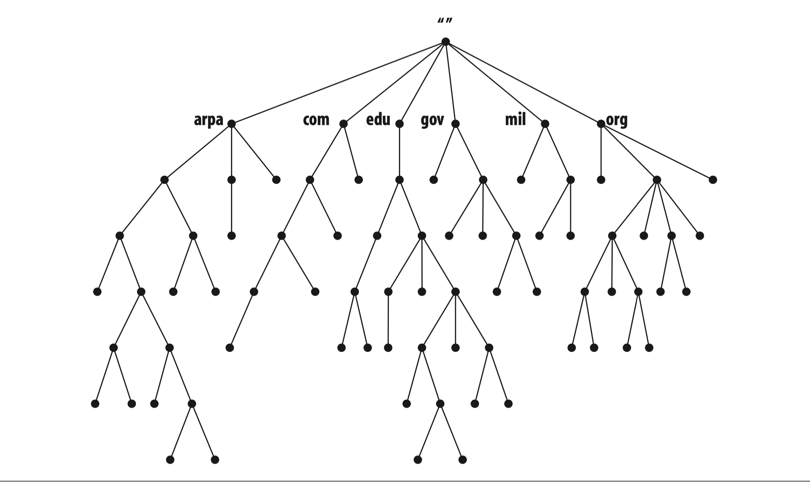
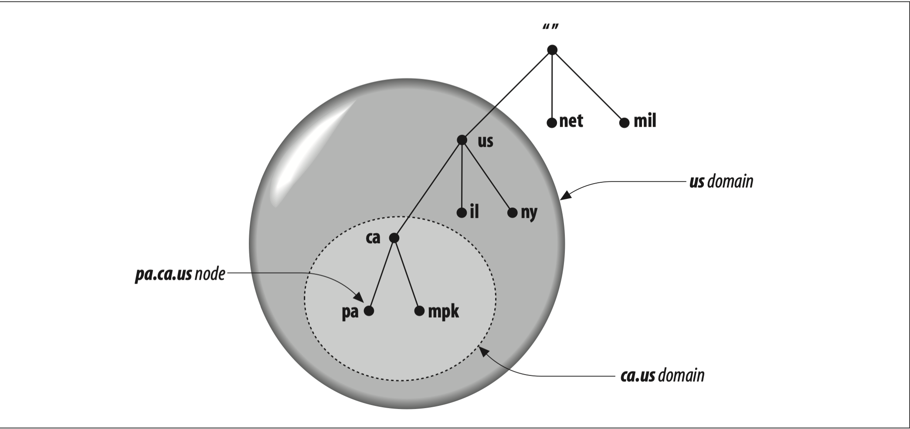
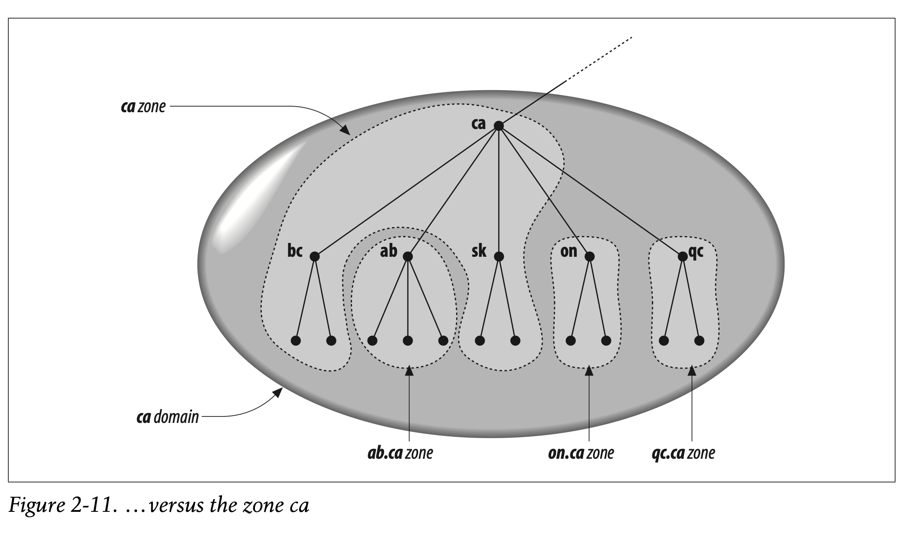
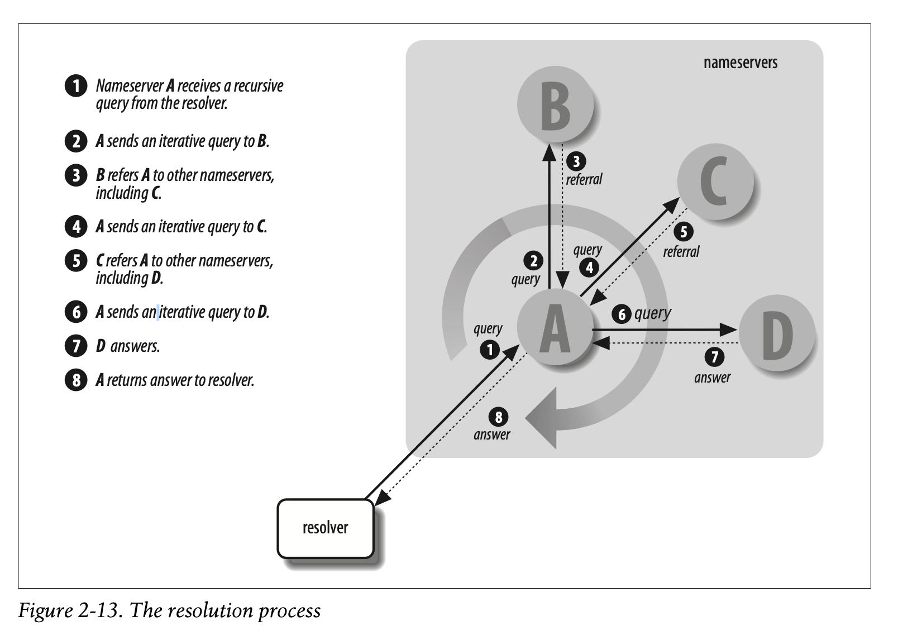
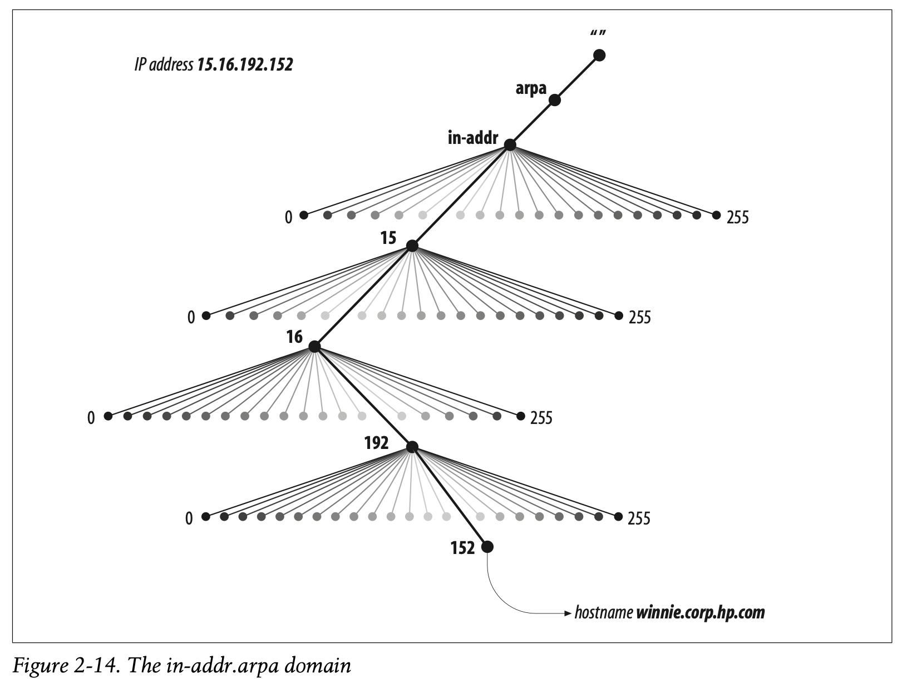

# How Does DNS Work

## The Domain Namespace

- Each domain name is just a path in a large inverted tree, called the ***domain namespace***
- The depth is 127  
- Each node has a text label, without dots (`.`), can go up to 63 characters
  - A null label is reserved for the root
  - Domain names are always read from node towards the root, with dots separating the names in the path
- The ending for the root appears as a dot, since it is null like `google.com.`
- A trailing dot in the domain names is interpreted as an *absolute* domain name in some softwares
  - *absolute* domain name is written relative to the root, and unambiguously specifies the node's location in the hierarchy
    - FQDN
- Names without trailing dots are sometimes interepreted *relative* to some domain name other than the root
  
- Sibling nodes should have different name --> to ensure uniqueness

## Domain

- Is simply a subtree of the domain namespace
- The domain name of a domain, is the same as the domain name of the node at the very top of the domain
- Any domain name in the subtree is considered part of the domain
  - A domain name can be in many subtrees, a domain name can also be in many domains
  - Hosts within a domain are logically related, often by geography or organizational affliations <;/br>
  
- Domain names at the *leaves* of the tree generally represent individual hosts
- *Interior* domain names can point at a host and also information about the domain
  - The type of information retrieved, when you use a domain name depends on the context which you use it
- A domain may have several subtrees of it's own called *subdomains*
  - Besides of being referred in relative terms, as subdomains of other domains, domains are foten referred to by level
    - Like *top-level domain* or *second-level domain*
      - These terms refer to the domain's position in the *domain namespace*
      - *top-level domain* or *first-level domain* is the child of the root
      - *second-level domain* is the child of the *first-level domain* and so on

## Resource Records (RRs)

- Data associated with domain names is contained in *Resource Records*
- Divided into classes, each of which pertains to a type of network or software
  - Currently there are classes for:
    1. *internets* (*any TCP/IP-based internet*)
    2. *Chaosnet protocols*
    3. *Hesiod Software*
  - Within a class records come in varieties of data that may be stored in the domain namespace
    - Different classes may define different record types, though some types are common to more than one class
      - For example every record class defines a record type of *address* type
      - Each *record* type in a given class defines a paricular record *syntax* to which all resource records of that class and type must adhere

## The Internet Domain Namespace

- No rules, but rather *traditions* in the upper-level domains
- *generic top-level domains*
- *country-code top-level domains*

## Delegation

- Decentralization
- An org responsible for a domain can subdivide it into more subdomains
  - Each subdomain can be delegated to other organizations
  - The parent domain, only retuains pointers to the sources of subdomain data

## Nameservers and Zones

- The pgrograms that store data about the domain namespace are called nameservers
- nameserver generally have information about some part of the domain namespace called *zone*, which they load from a *file* or another *nameserver*
  - The nameserver is then said to have *authority* for that zone, nameservers can also be *authoritive* for multiple zones too
- *domain* vs *zones*
  - All *top-level* domains and many domains at *second-level* and lower are broken into smaller more manageable units by delegation. These units are called *zones*
  - A zone contains all the domain names the domain with the same domain name contains, except for domain names in delegated subdomains  
    

## Types of Nameservers

- Two types
  1. **Primary masters** server for a zone
    - Reads the data for a zone from a file on it's host
  2. **Secondary masters** server for a zone (*slave*)
    - Gets the zone data from another nameserver authoritative for the zone, called its *master* server
- Quite often the master server is the zones primary master, but that is not required; a secondary master load zone data from another secondary
- When a secondary boots up, it contacts it's master nameserver and if necessary pulls the zone data over --> ***zone transfer***
- Both the *primary* and *secondary* masters are auhtoritative for that zone
- A *nameserver* can be *primary* for one zone and *slave* for another

## Zone Datafiles

- **Primary masters** load their data from these files
- **Slave nameservers** can also load their data from zone datafiles
  - Slaves normally backup their zone datafiles
  - After a restart they would first load the backed up zone datafile and then check it agains the **master's** zone datafile
- *Resource* records
- Subdomain *Delegation*

## Resolvers

- Programs for accessing nameservers
  - Querrying nameserver
  - Interpreting responses
  - Returning information to the requesting program
- **Stub resolver**

## Resolution

- Name Resolution or Resolution
  - Nameservers being capable of retriveing data for the namespaces that they are not authoritative of

## Root Nameservers

- Know where authoritative nameservers for each of the top level zones are
  - Given a query about any domain name, the root nameservers can provide address and details for at least the nameservers that are authoritative for the top level zone the domain ends in
  - Then top level nameservers can provide names and addresses for authoritative servers for the next level domain servers

## Recursion

- **Stub resolver** has no intelligence to follow successive referrals
  - *Recursive* query
- **Recursive** Vs **Iterative** query flavors
  * Recursive
    - The nameserver repeats the same basic process until it receives an answer
    - The nameserver can't just refer the query to a different nameserver
  * Iterative
    - A nameserver gives back the best answer it knows to the querier

## Choosing between Authoritative nameservers

- **Round Trip Time (RTT)**
  - Internal *Stopwatch*
  - *Random* RTT

## The whole Enchilada

- Quick look at how it works  

## Mapping Addresses to Names

- Is easy when using host tables (`/etc/hosts`)
  - Sequential search
- Using addresses as labels `in-addr.arpa`  
  

## Caching

- Nameservers that are authoritative for zones
- Negative cashing

## Time to Live

- Amount of time that any nameserver is allowed to cache the data
