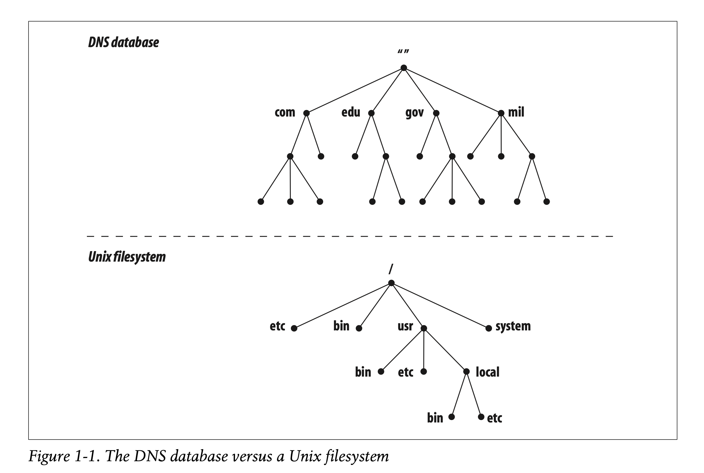
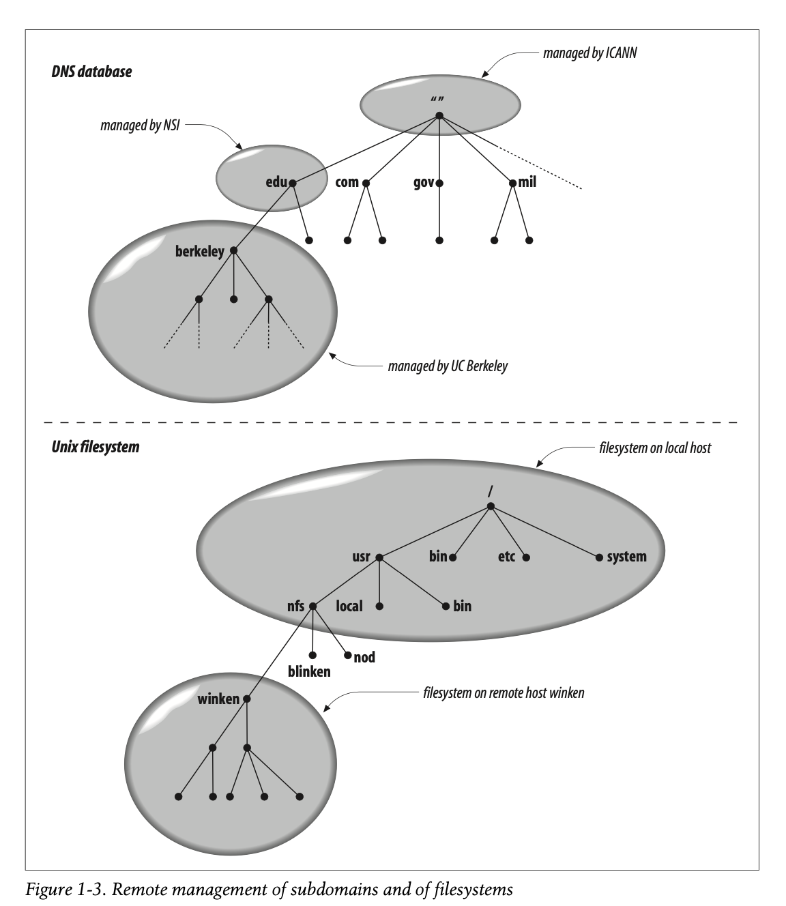
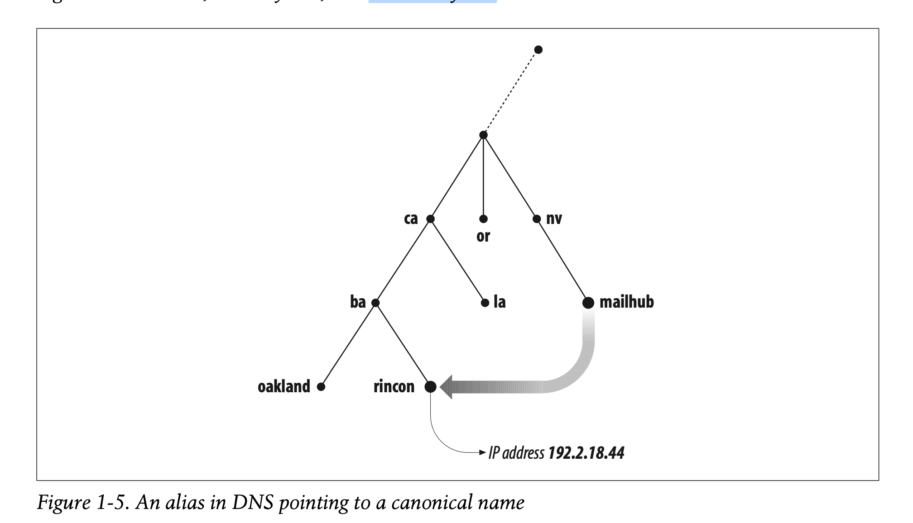

# Chapter 1

- At the beginning it was `HOSTS.TXT` later now known as `/etc/hosts`
  - Couldn't keep up with the growth of the ARPA NET

## DNS in a nutshell

- Distributed database
- *nameservers* constitute the server half of the DNS client/server
  - Contian information about some segments of the database, and make information available to the clients (*resolvers*)
- *Resolvers* are often library routines that create query and send them across the network to a *nameserver*
- The whole database resembeles to a tree like structure
  - Each node has got a text label, which identifies the node relative to it's parent.
    - For example the `com` relatively to it's parent would be `.com`
      - This is roughly analogous to *relative path* concept in UNIX file system
    - The `null` label or "" is reserved for the root node
      - In text the root node is written as a single dot `.`
        - Same as `/` in FS
  - Each node is the root of a new subtree of the overall tree
    - Each of these subtrees represent a portion of the overall database
  - Each domain or directory can be further divided into portions called *subdomains*  
    
  - Each domain has a domain's name, a domain's *domain name* identifies it's position in the database, much like an *absolute path*
  - In DNS the domain name is the sequence of labels from the node at the root of the domain, to the root of the whole tree, with dots separatin labels
  - Each domain can be further broken into subdomains and the responsibility for those subdomains can be doles out to different organizations
    - For example EDUCAUSE manages *edu* domain, but delegates the responsibility for the *berkeley.edu* subdomain to U.C. Berkeley
      - Something like remotely mounting a filesystem
  - Delegating authority for a domain (*berkeley.edu*) to another authority *U.C. Berkeley* here creates a new *zone*, an autonomously administered piece of the namespace
  - *berkeley.edu* is now independent of the *.edu* and conatains all domain names that end in *berkeley.edu*, the zone *edu* on the other contains domain names that end in *edu* but are not delegated zones, such as *berkeley.edu*
  - *berkeley.edu* may be divided into subdomains liek *cs.berkeley.edu* and some of these subdomains may themselves be separate *zones*
    - In case *cs.berkeley.edu* is delegated to other organization, then *berkeley.edu* does not contain domain names that end in *cs.berkeley.edu*  
    
- Domain names are used as *indexes* into the DNS database
  - Data attached to a domain name inside the database
  - Like in directories that contain subdirectories and files, domain names can also contain subdomains and hosts
  - A domain contains those hosts and subdomains whose domain names are within the domain's subtree of the namespaces
- Each host on the network has a domain name, which point to the information about the host
  - IP, mail routing, etc.
  - Hosts may have one or more domain name aliases, which are simply pointers from one domain name (the alias) to another (official domain name)
    - Look at the below figure and look at mailhub.nv  
    
