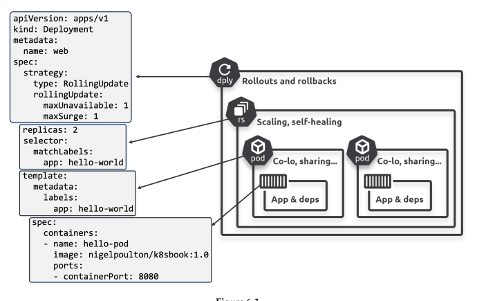

Deployments in k8s
==================

- Most popular way of running *stateless* apps on k8s
   - *self-healing*
   - *scaling*
   - *rollouts*
   - *rollbacks*

- *Deployment controller*
- They are comprised of
   1. A **resource** --> objects
   2. A **controller** --> Manages objects

- Every *Deployment* manages one or more identical pods
   - It is better visible in the following picture
   
   <center> The picture is taken from the The Kubernetes Book by Nigel Poulton </center>

### Scalers in k8s:
- Some of the **scalers in k8s** are:
   1. The horizontal *pod* autoscaler: adds and removes pods
   2. The vertical *pod* autoscaler: increases and decreases **CPU** and **Memory** allocated to running pods
   3. The *cluster* autoscaler: adds and removes cluster nodes
   - Apart from above there is also *multi-dimensional-autoscaling*

### States in k8s:
   1. *desired* state
   2. *observed* state
   3. *reconciliation*

- Reconciliation is fundamental to *desired* state
   - **reconciliation loop**
   - *replicaSet controller*

### Rolling update with *Deployments*
   1. Loosely coupled via APIs
      - Well defined APIs
      - No worries about updates and patches
      - *Formalized* APIs
   2. Backward and forward compatible
      - Independent updates

- Each **Deployment** describes the followings:
   1. Number of pod replicas
   2. Container images to use
   3. Network ports
   4. How to perform rolling updates

- A **Deployment** sits above the **ReplicaSet**, governing it's configuration and adding mechanisms for rollouts and rollbacks

#### rollouts and rollbacks
   - Insert *delays*
   - Control the *pace* and *cadence* of release
   - probe the *health* and *status* of the updated replicas

- A lable from ReplicaSet should match a label from pod

### Manual App *Scaling*
- two ways:
   1. Imperatively
      `kubectl scale deploy <deploymentName> --replicas <desiredNumberOfReplicas>`
   2. Declaratively
      - Editing the deployment file and re-posting it to the cluster

### Deployment file structure:
```
apiVersion: apps/v1
kind: Deployment
metadata:
   name: <Name>
   labels:
      <labelKey>: <label-value> # I guess uppercase is not allowed
spec:
   replicas: <noOfReplicas>                     # Belongs to replicaset
   selector:                                    # Belongs to replicaset
      matchLabels:                              # Belongs to replicaset
         <labelKey>: <labelValue>               # Belongs to replicaset
   revisionHistoryLimit: <noOfTheOldRevisionsYouWantToKeep> # Part of Deployment
   progressDeadlineSeconds: <timeBeforeConcludingARolloutPodFailed> # In seconds, Part of Deployment
   minReadySeconds: <WaitingTimeBetweenEachReplica>         # Part of Deployment
   strategy:                                                # Part of Deployment
      type: <updateStrategy>                                # Part of Deployment
      <updateStrategy>:                                     # Part of Deployment
         maxUnavailable: <noOfPodsToBeToleratedBelowDesiredState> # Part of Deployment
         maxSurge: <noOfPodsToBeToleratedAboveDesiredState> # Part of Deployment
   # Every coming below, belongs to the pod
   template:
      metadata:
         name: <PodsName>
         labels:
            <labelKey>: <label-value>
      spec:
         containers:
            - name: <containerName>
              image: <containerImage

```
- Some explanation regarding the *Deployments*:
   1. `revisionHistoryLimit` for example you set it to 5, means that 5 older versions' configurations would be kept, so in case something happens rollback are easy
   2. `progressDeadlineSeconds`: for example 300 means that once a pod is deployed, it would wait for 5 minutes before concluding that the rollout has failed
   3. `minReadySeconds`: for example 10 means, once a pod is deployed it will wait for 10 seconds, and then will start deploying the next pod. Better to keep this high, cause it gives you the chance to catch the errors, if there are any
   4. `updateStrategy` can be `rollingUpdate`
   5. `maxUnavailable`: for example setting it to 1 while the desired state of replicas is set to 10 means that the cluster is allowed to go down only to 9, not more than that
   6. `maxSurge`: for example setting it to 1 while the desired state of replicas is set to 10 means that the cluster is allowed to go up only to 11, not more than that
   7. You can pause a *deployment* while it is happening: `kubectl rollout pause deploy <deployName>`; to *resume* a paused rollout, instead of `pause` type `resume`
   8. You can see the *deployment* status using: `kubectl rollout status deployment <deployName>`
   9. The older replicaSets configs can be seen at `kubectl describe deploy <deoployName>`, they are in *oldReplicaSets*; with the same command you can get interesting info on a paused rollout
   10. A rollback can be done also
      - Check the available revisions on the cluster with the *deployment* using the command `k rollout history deployment <deploymentName>`
      - and also see the *replicaSets* `k get rs`
      - Now you can rollback to specific revision using the command:
         ```
         kubectl rollout undo deployment <deploymentName> --to-revision=<revisionName>
         ```
      - The above command is imperative, and it is not a good practice, but it is the one I've got for the time; don't forget to reflect the changes in definition file after rollback
