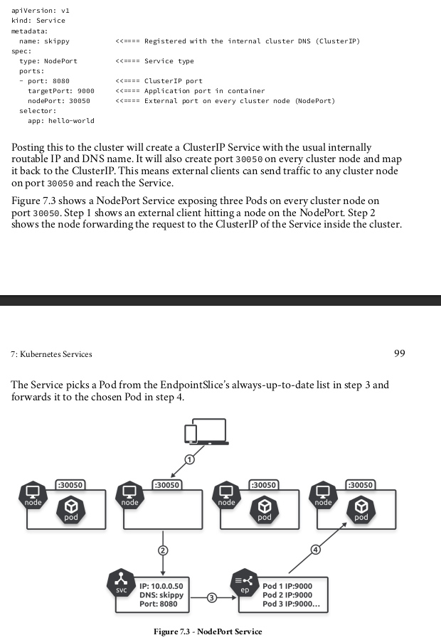
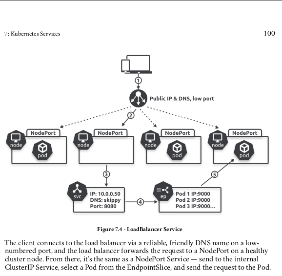

Kubernetes Services Chapter 7
=============================

- Every Service consists of:
   1. *front-end*
      - **DNS** name, **IP** address and network **port** --> never change

   2. *back-end*
      - **label selector**
         - Sends traffic to healthy pods, with **matching** labels
   - **Intelligent** --> update-to-date list of *healthy* pods

   - Labels and loose coupling

### Services and *EndpointSlices*
   - **endpointSlice controller**
   - Whenever a svc is created and associated endpointSlice is also created, in order to track healthy pods with matching labels, below is how it works:
      - A service is created
      - *endpointSlice controller* automatically creates an associated *endpointSlice* **object**
      - k8s watches the cluster looking for pods mathcing the service's labels selector
      - New podes matching the *selector* are added to the endpointSlice, whereas any deleted pods get removed
      - Applications send traffic to the service name, and the application's container uses the cluster DNS to resolve the name to an IP address
      - The container then sends the traffic to the Service's IP, and the Service forwards it to one of the pods listed in the EndpointSlices
### Service types
   - Major ones are:
      1. ClusterIP
         - most basic
         - provides a reliable endpoint (**name**, **ip** and **port**) on the internal pod network
         - only accessible from inside the cluster

      2. NodePort
         - The name says everything ;)
         - node port servies build on top of ClusterIP
         - External client to connect via a port on every cluster node
         - Consider the following example, from the book (Nigel Poulton - The Kubernetes Book 2024):
         
         - **Limitations**
            * ports between 30000-32767
            * Names or IPs of nodes should be known to the clients
            * Clients should also know, whether the node is healthy or not
      3. LoadBalancer
         - built on top of both
         - integrate with cloud load balancers for extremely simple access from the internet
         - Easiest way of exposing to external clients
         - Basically a **nodePort** with:
            - highly available **load-balancer**
            - **publicaly** available **DNS** name
            - **low port** number
         - Consider the following example, from the book (Nigel Poulton - The Kubernetes Book 2024):
         

## Commands:
   1. To create a service for a specific deployment: `k expose deploy <deploymentName> --type=<svcType>`; for example `k expose deployment test-deploy --type=LoadBalancer` --> creates a LoadBalancer service for the *deployment* called `test-deploy`.
      - It is smart enough, to detect the *label* on the deployment and map it by itself, and also creates a *NodePort* service underlying it and a *ClusterIP* underlying the *NodePort*
      - The port mapping between the *NodePort* and the pods is also done automatically, and the service is intelligent enough to find that one also, and map from *NodePort* to all *pods*
   2. To get a list of **endpointSlices** `k get endpointSlice`, and you can also look at all the endpointSlices for a specific service using the `k describe endpointSlice <endpointSliceName>`z
