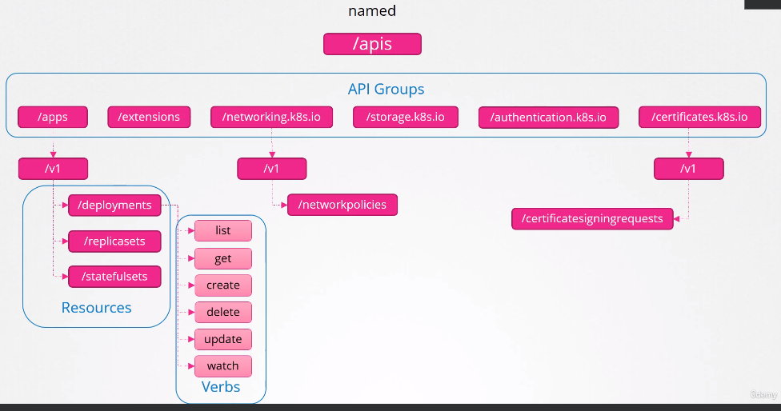

API Graph Groups
================

```
curl https://<kube-master>:6443/vrsion          # To get the version
curl https://<kube-master>:6443/api/v1/pods     # To get the pods
```

- K8S API is divided into different API groups, such as:
   * `/metrics`
      - Monitoring health of the cluster
   * `/healthz`
      - Monitoring health of the cluster
   * `/version`
   * `/api`
      - Responsible for the cluster functionality
      - **Core** group
         - All **Core** functionality
            - `nameSpace`, `pods`, `rc`, `events`, `endpoints`, `nodes`, `bindings`, `pv`, `pvc`, `configmaps`, `secrets`, `services`
   * `/apis`
      - Responsible for the cluster functionality
      - **Named** group
         - More **Organized**
            - `apps`
               - `deployments`, `replicasets`, `statefulsets`
            - `extensions`, `networking.k8s.io`--> `networkpolicies`, `storage.k8s.io`, `authentication.k8s.io`, `certificates.k8s.io` --> `certificatesigningrequests`
      - First levels are **API Groups** and the ones below are **resrouces**
      - Each **Resource** has a set of actions with it, such as:
         - `list`, `get`, `create`, `delete`, `update`, `watch`
         - Things that can be done with the resources
         - Also known as **VERBS**
         

   * `/logs`
      - For integrating with 3rd party logging applications
- `curl https://localhost:6443 -k` --> list available api groups
- `curl https://localhost:6443/<apiGroup> -k | grep "name"` -- Returns all the supported resource groups within the *named* api groups
- You should also pass the following options:
```
curl https://localhost:6443 -k \
   --key <adminKey>
   --cert <adminCert>
   --cacert <caCert>
```
- If you can't find the proper keys for the above approach they should be available in the `~/.kube/config` file, you just have to **decond** them and pass them as options

- An **Alternate** way would be to start a `kube proxy` and then pass the requests to it and it will use the credentials from the `kube-config` to fulfill the requests
```
k prox &
curl http://localhost:8001 -k
```

* **NOTE**
   - `kube proxy` **Not Equal** `kubectl proxy`
   - 
