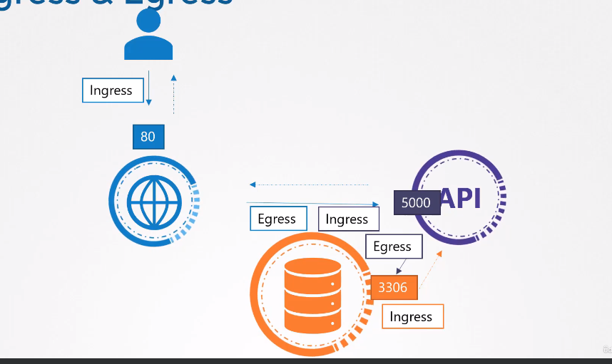
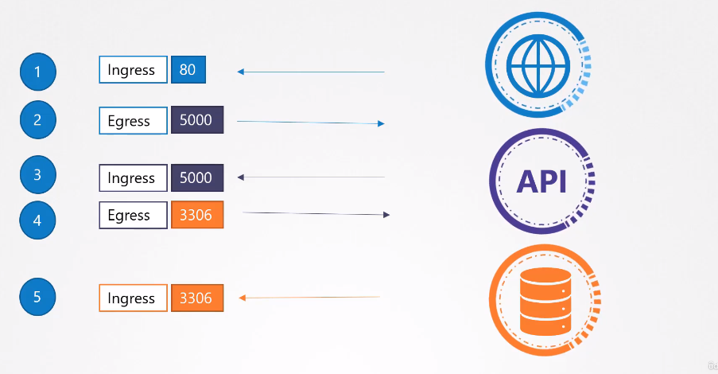
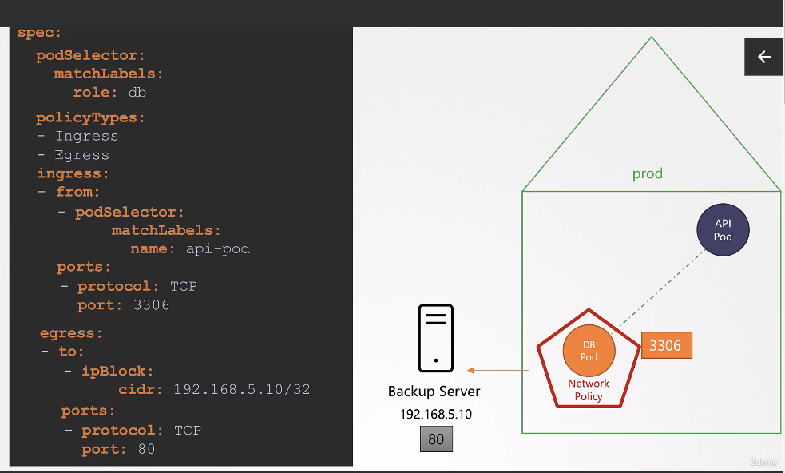

Network Policy
==============
# 177. Network Policy
- **Ingress** & **Egress** traffic
- The direction in which the traffic originated



- **Default** traffic rule
   - *`All Allow`* --> Any pod to any pod or services
- **Network Policy** -- Allow or dis-allow traffic
## Network Policy
- Another object in the K8S namespace
- Linked to one or more pods
- Can define rules within the policy
- For example having one on `DB` pod and saying to only allow `ingress` traffic from the `API` pod on port `3306`
   - Once created will block all the traffic to the `DB` pod and only allow traffic from `API` pod on port `3306` (what matches the specified rule)
- Can be done using `labels` and `selectors`
- Within the `network policy` object definition file and under the `policy`, you can specify to **allow** or **block** **ingress** or **egress** traffic

- For example the above picture could be configured like this
```
apiVersion: networking.k8s.io/v1
kind: NetworkPolicy
metadata:
   name: <given-name>
spec:
   podSelector:
      matchLabels:
         role: db
   policyTypes:
      - Ingress
   ingress:
      - from:
         - podSelector:
            matchLabels:
               name: api-pod
         ports:
            - protocol: TCP
              port: 3306
```

- For **Ingress** or **Egress** traffic to go under the rule they should be mentioned under `.spec.policyTypes`. In the above example we have `Ingress` defined, so in this case the `Egress` will not be affected

- Network policies are implemented by the **Network Solutions** and not all of them support it
   - Some of which supporting it are: `kube-router`, `Calico`, `Romana`, `Weave-net`
   - An example of a solution not supporting it would be `Flannel`

# 178. Developing Network Policies
## Ingress
- Consier the example from the previous section (177. Network Policy)
- We are trying to restrict all access to `DB` pod, but only `Ingress` traffic from `API` pod on port `3306`
- As First step we are going to block all the traffic on the pod
```
apiVersion: networkig.k8s.io/v1
kind: NetworkPolicy
metadata:
   name: db-policy
spec:
   podSelector:
      matchLabels:
         role: db
```
- Above policy will block all the traffic on the pod, but we don't want it like this
- First step would be to decide on the `policyType`, can be either `Ingress` or `Egress`
   - Looking from the `DB` pod perspective, it is incoming traffic coming from `API` pod, so it is gonna be `Ingress` traffic
   - What about the `DB` pod response back to the `API` pod (*results* of the queries); do we want them to go back or not?
      - **NO**, cause once you allow an incoming `Ingress` traffic the response to that traffic is allowed **automatically**, don't need to create a separate rule for that
   - So in this case we will need on an `Ingress` rule to allow traffic from `API` pod to the `DB` pod
   - This doesn't mean that the `DB` pod would be able to make calls to the `API` pod
      - Only the response to the `Ingress` traffic related to the configured policy would be allowed
   - We can also define **Both** policies within a single policy definition file
   - But for now we attach this to the previously written policy
   ```
   policyTypes:
      - Ingress
   ```
- After deciding on the type of policy, we have to decide on the policy's specifics
- within this we can specify policy's *`rules`*
   - Each `rule` has a `- from` and `port` field
      - `- from` field defines the source of the traffic allowed to pass through to the `DB` pod
         - We use a `podSelector` and define the pod under the `matchLabels` part
      - `ports` defines what ports on the traffic coming from the pod is allowed to go to
- The final file would look like:
```
apiVersion: networking.k8s.io/v1
kind: NetworkPolicy
metadata:
   name: db-policy
spec:
   podSelector:
      matchLabels:
         role: db
   policyTypes:
      - Ingress
   ingress:
      - from:
        - podSelector:
            matchLabels:
               name: api-pod
        ports:
         - protocol: TCP
           port: 3306
```

### `NameSpaces`
- What if you have multiple `API` pods on different `namespaces` and you want all of the to be able to communicate to the `DB` pod
   - Above policy would allow any pod on any `namespaces` with the matching label to communicate with the `DB` pod
   - But how to **Block** the traffic, and only allow from a desired `namespace`
      - First add a label on the desired `namespace`; for example we would add label `name: prod` on the `nameSpace`
      - under `- from` at the same level as `- podSelector` add the following
      ```
      namespaceSelector:
         matchLabels:
            name: prod
      ```
- If only the `namespaceSelector` is defined and no `podSelector` is defined, then the rule will be applied to all *Pods* within the specified `nameSpace`

### Cluster External Traffic
- Assume we have a `backup server` which would like to be able to backup the `DB` pod, for backups
- For this we can configure the network policy to allow traffic from certain IP addresses or **IP Range**
- For this we under `.spce.ingress.-from.` we add a new definition names as `ipBlock` --> Specify a range of IP addresses from which you could allow traffic to hit the `DB` pod
```
ingress:
   - from:
     - podSelector:
     ...
       namespaceSelector:
       ..
     - ipBlock:
         cidr: <ipRange>
```

- So we have 3 types of selectors under the `- from` field:
   - `- podSelector`
   - `  namespaceSelector`
   - `- ipBlock`
   - In the above example the first two, fall under a single rule
   ```
   - podSelector:
   ...
     namespaceSelector:
     ...
    ```
   - The logic between these different rules is of type `OR` or `||`
   - But the logic between sub-rules is `AND` or `&`
      - For example between `podSelector` and `namespaceSelector`
      - But if we want to treat them as separate rules we would just don't put them inside one another, and we would have them like this:
      ```
      - podSelector:
      ...
      - namespaceSelector:
      ...
      - ipBlock:
      ...
      ```
## Egress
- Assume that on the `DB` pod we have a backup agent, which would push the backup by itself to the backup server (which is outside the cluster and has ip of: `192.168.5.10`), rather than backup server initiating the backup process
- We just add `- Egress` to the `policyType` section and also add the `egress:` section after it, and define the specifics of our request


```
- policyTypes:
   - Ingress
   - Egress
   ingress:
   ...
   egress:
      - to:
         - ipBlock:
            cidr: 192.168.5.10/32
         ports:
            - protocol: TCP
              port: 80

```

- The following is an example from the course labs:
```
apiVersion: networking.k8s.io/v1
kind: NetworkPolicy
metadata:
  name: internal-policy
  namespace: default
spec:
  podSelector:
    matchLabels:
      name: internal
  policyTypes:
  - Egress
  - Ingress
  ingress:
    - {}
  egress:
  - to:
    - podSelector:
        matchLabels:
          name: mysql
    ports:
    - protocol: TCP
      port: 3306

  - to:
    - podSelector:
        matchLabels:
          name: payroll
    ports:
    - protocol: TCP
      port: 8080

  - ports:
    - port: 53
      protocol: UDP
    - port: 53
      protocol: TCP
```
