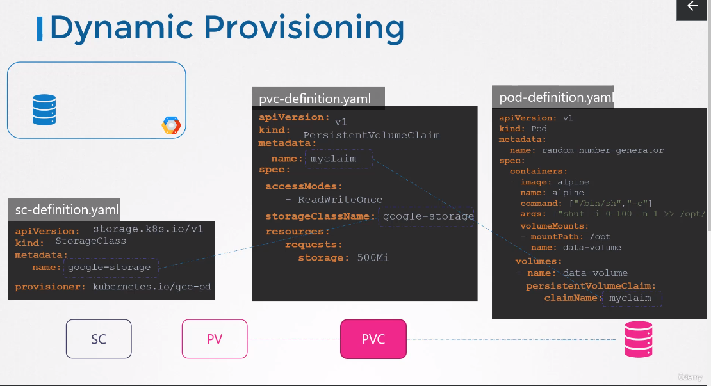

Storage Classes
===============

- **Static Provisioning**
   - Storage should be created and the name of the storage should be given in the `PV` definition file manually

## Dynamic Provisioning
- **Storage Classes**
   - Define a **Provisioner** such as `Google Storage`, that can automatically provision storage on `Google Cloud` and attach that to pods when a `Claim` is made
- It is done by creating `storage class` object definition file
- For example the file for our specific example case would be like:
   ```
   apiVersion: storage.k8s.io/v1
   kind: StorageClass
   metadata:
      name: <name>                     # Example google-storage
   provisioner: kubernetes.io/gce-pd   # The Provisioner defined here is specific for Google example
   ```
- Having all above, we don't need `PV` anymore, we can create `Claims` using the `Storage Class` that was just created
- In order to use it we specify the `StorageClassName` in `Claim` definition file
- The `pvc` definition file would look like:
```
apiVersion: v1
kind: PersistentVolumeClaim
metadata:
   name: <claimName>
spec:
   accessModes:
      - <mode>
   StorageClassName: <StorageClassName>      # In our example it would be google-storage
   resources:
      requests:
         storage: <size>                     # For example 500Mi
```
- With the above `PVC` file, it will use the storage class named as `google-storage`
- Next time a `PVC` is created, the *storage class** associated with it will use the defined `provisioner` in the `StorageClass` to **Provision** a new disk with the required size on `GCP` and then creates a `PV` and binds the `PVC` to that `PV`
- So you don't have to create `PV` manually anymore


- There are many other **Provisioners** as well, for example `AWSElasticBlockStore` for `AWS`
   - More *Parameters* can also be passed, for example to define the *type* of disk, *replication* type and etc...
   - These *Parameters* are very specific to provisioner being used
   - For our example:
   ```
   apiVersion: storage.k8s.io/v1
   kind: StorageClass
   metadata:
      name: <name>
   provisioner: kubernetes.io/gce-pd
   parameters:
      type: <type>
      replication-type: <repType>
   ```
- You can create different `Storage Classes` with each using different type of **DISK**, for example
   - **Silver** with standard `Disk`
   ```
   apiVersion: storage.k8s.io/v1
   kind: StorageClass
   metadata:
      name: Silver
   provisioner: kubernetes.io/gce-pd
   parameters:
      type: pd-standard
      replication-type: none
   ```
   - **Gold** with *SSD* `Disk`
   ```
   ...
   parameters:
      type: pd-ssd
      replication-type: none
   ```
   - **Platinum** with *SSD* `Disks` and `replication`
   ```
   ...
   parameters:
      type: pd-ssd
      replication-type: regional-pd
   ```
   - With the above approach, you would have different classes of service 
