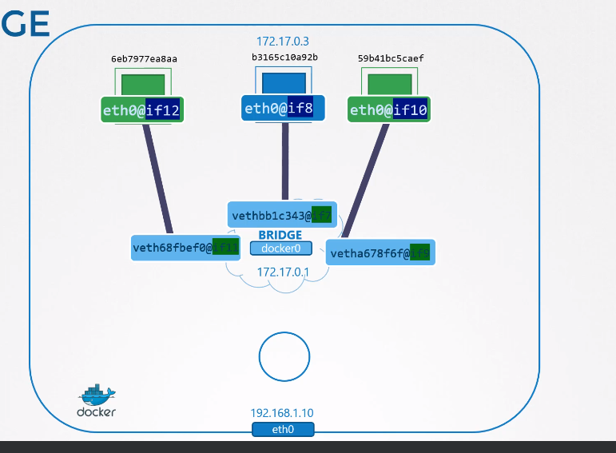

Docker Networking
=================
- Different options to choose from
## 1. **None** Network
   - No network
   - `--network none`
## 2. **Host** Network
   - Attached to the Host network
   - `--network host`
## 3. **Bridge** Network
   - Internal private network
   - Default Address `172.17.0.0`
   - Seen as `docker0` on the host
   - Same as bridge concept in `namespaces`
   - Whenever a container is created Docker creates a **network namespace** for it, as we saw in the last lectures
   - The following process is followed everytime a new container is created:
      - Docker creates a namespace
      - Creates a pair of interfaces
      - Attaches one end to the container and the other end to the bridge switch
      - The pairs can be recognized by subsequent odd and even pairs
         - `if12` and `if11`
         - `if10` and `if09`
         - `if08` and `if07`
      - All the containers attached to the bridge are part of the same network and can communicate with each other
      - 
### 3.1 Port Mapping
- By now only hosts connected to the bridge are able to access containers on it
   - This includes the host itself and other containers with bridge network on that host
- You can map container traffic to host traffic
- `docker run -p 8080:80 nginx`
   - Maps traffic on `nginx` container to port 80 --> to host on port 8080
   - It is done using `iptables` rules
