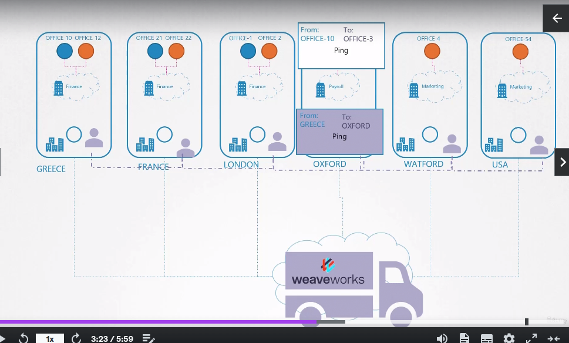

CNI Weave
=========
- How **Weave** solution works
- In previous lectures the network solution which was configured by us, manually routed the packet from a pod on one host to another, through the router
- As it gets bigger, it also gets more difficult to keep track of all **namespaces** and their **routes**
- According to the *Office* and *packages* terminology inside the lecture, once we get a third party company (**Weave works in this case**) the following happens
   - They place their agents in each of our Offices
   - Agents keep talking to each other and are well connected
   - So when a package is destined from an office to another it is intercepted by the agent, and looks at the target office name and know exactly which site and department that office is
   - Puts the package into the company's customized package (*Encapsulates*) and sends it to the destination
   - Upon package reception at the destination site, it is intercepted by the company's agent
   - Opens the added package (*Decapsulates*) and retrieves the original package
   - Delivers it to the right recipient
   
- A couple of more points to consider:
   - Each agent stores a **Topology** of the entire setup
   - Creates it's own **bridge** on the nodes and calls it `weave`
   - Assigns IP addresses to each node
   - A single pod could be attached to **multiple** `bridge` networks

## How to deploy `Weave`
- can be done manually or can be done as pods
