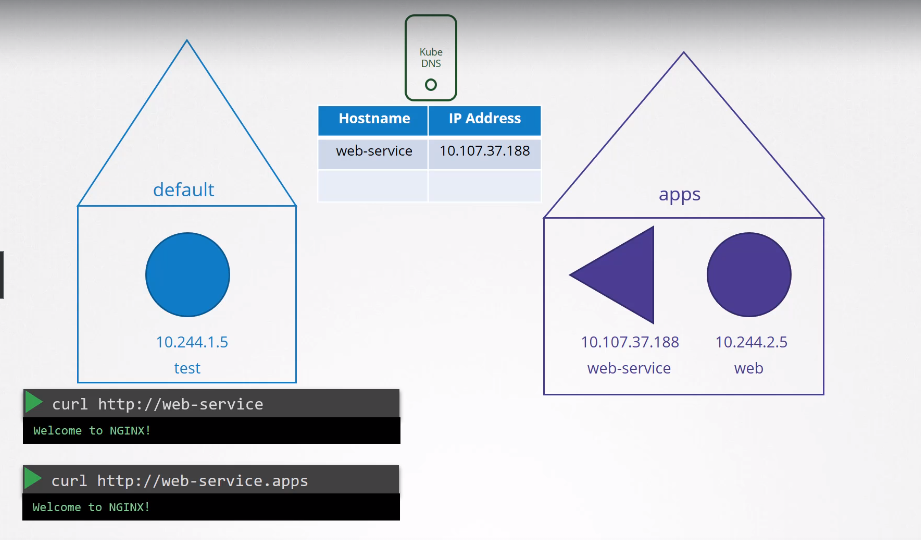
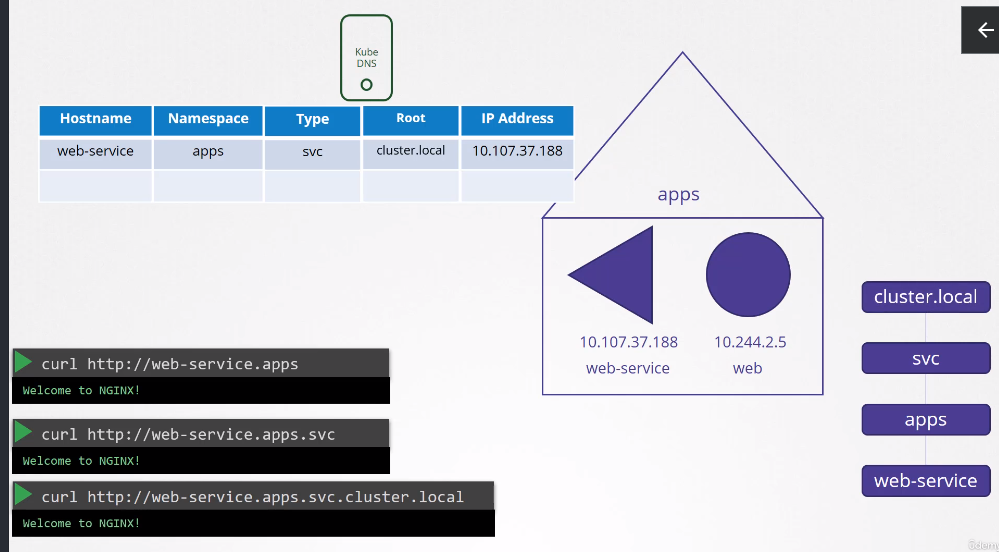
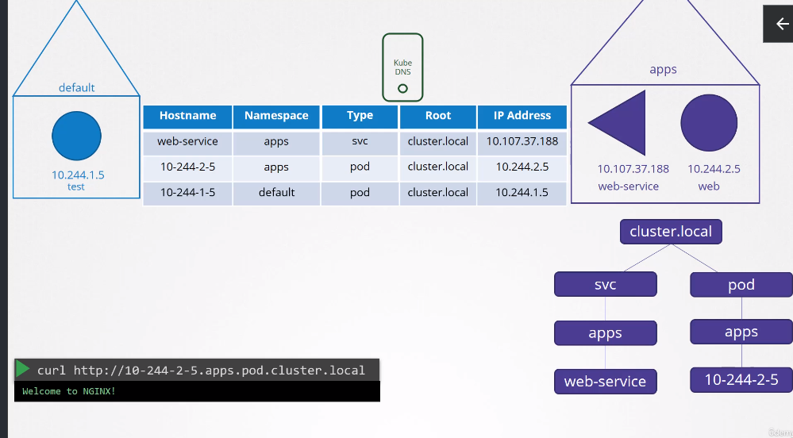

DNS in Kubernetes
=================

- A built in **DNS** Server is deployed by k8s
   - Can also be done manually
 - This focused purely on Services and pods within the cluster

## Services
 - Whenever a **SVC** is created a `svc-dns-record` is created by the k8s
   - Maps name to the ip
   - The **SVC** can be reached by any pod within the cluster, using it's *name*
   - Above is true, when they are in the same `namespace`
   - In case they are in different `namespaces`, you can refer to them: `curl http://<svcName>.<namespaceName>`
   
- For each **SVC** a subdomain is created by **DNS**
   - All the services are grouped together in a subdomain called `svc`
- All **PODS** and **SVCs** for a namespace are grouped together within a subdomain in the name of the namespace
   - For example `<hostName>.<namespace>`
- All the **SVCs** are further grouped together into another subdomain called `svc`
   - For example `<hostname>.<namespace>.<svc>`
- All the **SVCs** and **PODS** are grouped together, into a *root* domain for the cluster which is set to `cluster.local` and that the *FQDN* for the service

## PODS
- Records for pods are not created by default
   - Can be *enabled*
   - Only IP with dashes instead of dots

