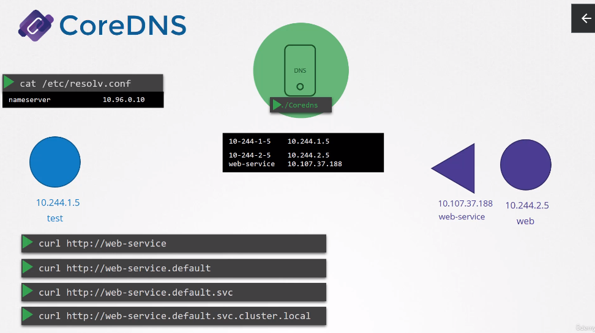

Core DNS in Kubernetes
======================
- How to make name communication among `pods`
   - Easiest way --> Add names to the `/etc/hosts` ;)
   - A lot of pods --> DNS Server
      - And add DNS server in `/etc/resolv.conf`
      - Almost the same thing in k8s
         - Not for *pods* but for *services*
            - For *pods* it is done with *dashed* **ip addresses**
   - *DNS Server* is deployed within the cluster
      - `coreDNS`
## `coreDNS`
- Deployed as *pod*
   - Two for redundancy
   - As a rs within a deployment
- Requires a config file, named as `corefile` at `/etc/coredns/corefile`
   - A number of *plugins* are configured within this file
   - The *plugin* that makes `coreDNS` work with kubernetes is the `kubernetes` *plugin*
      - The TLD of the cluster is also set here
      - Multiple options within the *plugin*
         - `pods` --> creating a record for pods in the cluster
      - Any record the *DNS* server can't resolve is forwarded to the coreDNS's `/etc/resolv.conf` file
         - And it is set to use the name server from the kubernetes *node*
   - This core file is passed to the *pod* as a *`configMap`* object
      - can be found using `k get configmaps -A`
   - If you would like to modify the configuration for this file, you just have to modify the `configMap` file

### Pods pointing to the `coreDNS` server
- When the `coreDNS` is deployed it also creates a *service* to make it available to other components within the cluster
   - Named as  `kube-dns` by default
- The IP of this service is configured as `nameserver` on *pods*
   - This configuration is done automatically by `kubelet`
   - Looking at `kubelet` config, you will find the *DNS* server ip and domain in it
      - It is located at `/var/lib/kubelet/config.yml`
         - `clusterDNS` and `clusterDomain`
      - How to access services?
      
   - If you try to `nslookup` the *service*, it will return the fqdn of the service
      - How this happens?
         - Because the `/etc/resolv.conf` has a `search` entry which is `deafult.svc.cluster.local`, `svc.cluster.local`, `cluster.local`
         - However it only has `search` entries for the services not pods, for them you have to specify the fqdn of the pod `<podDashedIP>.default.pod.cluster.local`

## Useful commands
- 
