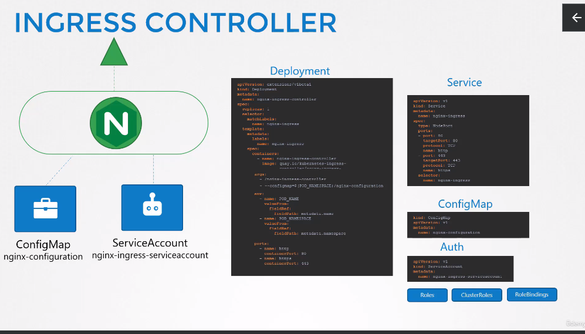

Ingress
=======

- When to use *Ingress* and when to use *SVC*
  

## Ingress
- Config routes to different services, based on `url` pod
- Implement **SSL** security
- You can think of it as a **Layer 7** load balancer
   
- Even *Ingress* has to be exposed, to be reachable from outside
   - `NodePort` or `LoadBalancer`
- Without `Ingress`
   - Choose a proxy or loadbalancer
   - Deploy them on cluster
   - Configure route, url routes, ssl certs, and etc
- `Ingress` is kind of the same thing
   - Deploy a supported solution (Can be some of the proxies used without ingress)
   - Specify a set of rules to *configure* ingress
- The solution deployed is called **Ingress Controller**
- The rules configured are called **Ingress Resources**
   - Created using definition files
- A k8s cluster does not come with an Ingress **Controller** by default

### Ingress Controller
- A number of options available:
   - GCP HTTP(S) LoadBalancer (GCE)
   - Ngingx
   - Contour
   - Haproxy
   - traefik
   - istio
- GCE and Nginx supported and maintained by k8s project
- Not only loadbalancer, but additional components (intelligence) built into them to monitor for new definitions and Ingress resources and configure the Controller accordingly
- **Nginx** is used as example here
- Is deployed as another deployment in cluster
```
apiVersion: extensions/v1beta1
kind: Deployment
metadata:
   name: nginx-ingress-controller
spec:
   replicas: 1
   selector:
      matchLabels:
         name: nginx-ingress
   template:
      metadata:
         labels:
            name: nginx-ingress
      spec:
         containers:
            - name: nginx-ingress-controller
              image: quay.io/kubernetes-ingress-controller/nginx-ingress-controller:0.21.0
        # the nginx program is stored at /nginx-ingress-controller so it has to be passed as the command to start the nginx-controller-service
         args:
            - /nginx-ingress-controller
            - --configmap= $(POD_NAMESPACE)/nginx-configuration      # Passing the ConfigMap
         env:
            - name: POD_NAME
              valueFrom:
               fieldRef:
                  fieldPath: metadata.name
            - name: POD_NAMESPACE
              valueFrom:
               fieldRef:
                  fieldPath: metadata.namespace
         ports:
            - name: http
              containerPort: 80
            - name: https
              containerPort: 443
```
- `POD_NAME` and `POD_NAMESPACE` --> Required by nginx-service to read the configuration data from within the pod
- `ports` ports used by the ingress controller
- nginx has a set of configuration options, such as path to store the logs, keep alive threshold, ssl settings, session timeout and etc..
   - In order to decouple these configuration data from the nginx-controller-image, a `configMap` must be created and passed in (a blank object will do)
      - Makes it easy to modify the configuration settings in the future
         - Only needs to be added to the configMap, and not the nginx configuration file
   ```
   kind: ConfigMap
   apiVersion: v1
   metadata:
      name: nginx-configuration
   ```
- A **Service** is also needed to expose the Ingress controller to the external world
   - Would be of type `NodePort`
```
apiVersion:
kind: Service
metadata:
   name: nginx-ingress
spec:
   type: NodePort
   ports:
      - port: 80
        targetPort: 80
        protocol: TCP
        name: http
      - port: 443
        targetPort: 443
        protocol: TCP
        name: https
   selector:
      name: nginx-ingress
```
- A **Service Account** with the right set of permissions is also needed for the **Ingress Controller** to monitor the cluster for **Ingress Resources** and configure the end of line nginx server when something is changed
   - The service account should be created with correct roles and roleBindings
```
apiVersion: v1
kind: ServiceAccount
metadata:
   name: nginx-ingress-serviceaccount
```
- All can be seen below


### Ingress Resources
- Set of rules and configurations applied on the **Ingress Controller**
- For example forward all the traffic to a single app or different apps
   - Based on URLs or Domain Names
- Created using a definition file (k8s)
```
apiVersion: extensions/v1beta1
kind: Ingress
metadata:
   name: ingress-wear
spec:
   backend:
      serviceName: wear-service
      servicePort: 80
```
- Under `spec` comes the `backend`
   - As you know the traffic is routed to the applications services not the pods directly
      - So the `backend` section will define where the traffic will be routed to
   - If it is a single `backend` then you don't have rules, can be done by simply specifying the `serviceName` and the `servicePort`
- `Rules` are used when you want to route traffic based on different conditions
   - Within each `rule` different `paths` can be handled
   - Rules at the top for each **host** or **domainName** and within each rule you have different paths, to route traffic based on **url**
   
- So how to do this, we will start where we left off:
```
apiVersion: extensions/v1beta1
kind: Ingress
metadata:
   name: ingress-wear
spec:
   rules:
      - http:
        paths:
         - path: /wear
            backend:
               serviceName: wear-service
               servicePort: 80
         - path: /watch
            backend:
               serviceName: watch-service
               servicePort: 80
```
- can also be done using **domainName**
```
apiVersion: extensions/v1beta1
kind: Ingress
metadata:
   name: ingress-wear
spec:
   rules:
      - host: wear.my-online-store.com
        http:
         paths:
            - backend:
               serviceName: wear-service
               servicePort: 80
      - host: watch.my-online-store.com
        http:
         paths:
            - backend:
               serviceName: watch-service
               servicePort: 80
```
- In the above definition file we have a single `backend` path for each rule, but you can have multiple `paths` in each of rules
- Finally we have two different approaches:
   1. Splitting traffic by **URL**
      - One rule, and use paths to split the traffic
   2. Splitting traffic by **hostName**
      - Two rules and one path specification in each rule

## Update on Ingress
   - `apiVersion: networking.k8s.io/v1`
   - And differences in definition file also

## Useful commands
- If non of the paths or rules are matched it will switch to `Default backend`
- **rewriteTarget**
   - Comes under `.metadata.annotations:`
   ```
   ...
   metadata
      annotations:
         nginx.ingress.kubernetes.io/rewrite-target: /
   ...
   ```


- **Example** from **Lab** (Ingress **Controller** definition file)
```
apiVersion: apps/v1
kind: Deployment
metadata:
  labels:
    app.kubernetes.io/component: controller
    app.kubernetes.io/instance: ingress-nginx
    app.kubernetes.io/managed-by: Helm
    app.kubernetes.io/name: ingress-nginx
    app.kubernetes.io/part-of: ingress-nginx
    app.kubernetes.io/version: 1.1.2
    helm.sh/chart: ingress-nginx-4.0.18
  name: ingress-nginx-controller
  namespace: ingress-nginx
spec:
  minReadySeconds: 0
  revisionHistoryLimit: 10
  selector:
    matchLabels:
      app.kubernetes.io/component: controller
      app.kubernetes.io/instance: ingress-nginx
      app.kubernetes.io/name: ingress-nginx
  template:
    metadata:
      labels:
        app.kubernetes.io/component: controller
        app.kubernetes.io/instance: ingress-nginx
        app.kubernetes.io/name: ingress-nginx
    spec:
      containers:
      - args:
        - /nginx-ingress-controller
        - --publish-service=$(POD_NAMESPACE)/ingress-nginx-controller
        - --election-id=ingress-controller-leader
        - --watch-ingress-without-class=true
        - --default-backend-service=app-space/default-http-backend
        - --controller-class=k8s.io/ingress-nginx
        - --ingress-class=nginx
        - --configmap=$(POD_NAMESPACE)/ingress-nginx-controller
        - --validating-webhook=:8443
        - --validating-webhook-certificate=/usr/local/certificates/cert
        - --validating-webhook-key=/usr/local/certificates/key
        env:
        - name: POD_NAME
          valueFrom:
            fieldRef:
              fieldPath: metadata.name
        - name: POD_NAMESPACE
          valueFrom:
            fieldRef:
              fieldPath: metadata.namespace
        - name: LD_PRELOAD
          value: /usr/local/lib/libmimalloc.so
        image: registry.k8s.io/ingress-nginx/controller:v1.1.2@sha256:28b11ce69e57843de44e3db6413e98d09de0f6688e33d4bd384002a44f78405c
        imagePullPolicy: IfNotPresent
        lifecycle:
          preStop:
            exec:
              command:
              - /wait-shutdown
        livenessProbe:
          failureThreshold: 5
          httpGet:
            path: /healthz
            port: 10254
            scheme: HTTP
          initialDelaySeconds: 10
          periodSeconds: 10
          successThreshold: 1
          timeoutSeconds: 1
        name: controller
        ports:
        - name: http
          containerPort: 80
          protocol: TCP
        - containerPort: 443
          name: https
          protocol: TCP
        - containerPort: 8443
          name: webhook
          protocol: TCP
        readinessProbe:
          failureThreshold: 3
          httpGet:
            path: /healthz
            port: 10254
            scheme: HTTP
          initialDelaySeconds: 10
          periodSeconds: 10
          successThreshold: 1
          timeoutSeconds: 1
        resources:
          requests:
            cpu: 100m
            memory: 90Mi
        securityContext:
          allowPrivilegeEscalation: true
          capabilities:
            add:
            - NET_BIND_SERVICE
            drop:
            - ALL
          runAsUser: 101
        volumeMounts:
        - mountPath: /usr/local/certificates/
          name: webhook-cert
          readOnly: true
      dnsPolicy: ClusterFirst
      nodeSelector:
        kubernetes.io/os: linux
      serviceAccountName: ingress-nginx
      terminationGracePeriodSeconds: 300
      volumes:
      - name: webhook-cert
        secret:
          secretName: ingress-nginx-admission

---
apiVersion: v1
kind: Service
metadata:
  creationTimestamp: null
  labels:
    app.kubernetes.io/component: controller
    app.kubernetes.io/instance: ingress-nginx
    app.kubernetes.io/managed-by: Helm
    app.kubernetes.io/name: ingress-nginx
    app.kubernetes.io/part-of: ingress-nginx
    app.kubernetes.io/version: 1.1.2
    helm.sh/chart: ingress-nginx-4.0.18
  name: ingress-nginx-controller
  namespace: ingress-nginx
spec:
  ports:
  - port: 80
    protocol: TCP
    targetPort: 80
    nodePort: 30080
  selector:
    app.kubernetes.io/component: controller
    app.kubernetes.io/instance: ingress-nginx
    app.kubernetes.io/name: ingress-nginx
  type: NodePort
```

- **Example** from **Lab** (Ingress **Resource**)
   - The scenario is also given below the code
      - Can also be **Generated** by `k create ingress wear-watch-ingress --annotation nginx.ingress.kubernetes.io/rewrite-target=/ -n app-space --rule="/wear=wear-service:8080" --rule="/watch=watch-service:8080"`
```
---
apiVersion: networking.k8s.io/v1
kind: Ingress
metadata:
  name: ingress-wear-watch
  namespace: app-space
  annotations:
    nginx.ingress.kubernetes.io/rewrite-target: /
    nginx.ingress.kubernetes.io/ssl-redirect: "false"
spec:
  rules:
  - http:
      paths:
      - path: /wear
        pathType: Prefix
        backend:
          service:
           name: wear-service
           port:
            number: 8080
      - path: /watch
        pathType: Prefix
        backend:
          service:
           name: video-service
           port:
            number: 8080
```

- **Scenario**
```
Create the ingress resource to make the applications available at /wear and /watch on the Ingress service.

Also, make use of rewrite-target annotation field: -

nginx.ingress.kubernetes.io/rewrite-target: /


Ingress resource comes under the namespace scoped, so don't forget to create the ingress in the app-space namespace.


Ingress Created

Path: /wear

Path: /watch

Configure correct backend service for /wear

Configure correct backend service for /watch

Configure correct backend port for /wear service

Configure correct backend port for /watch service
```
