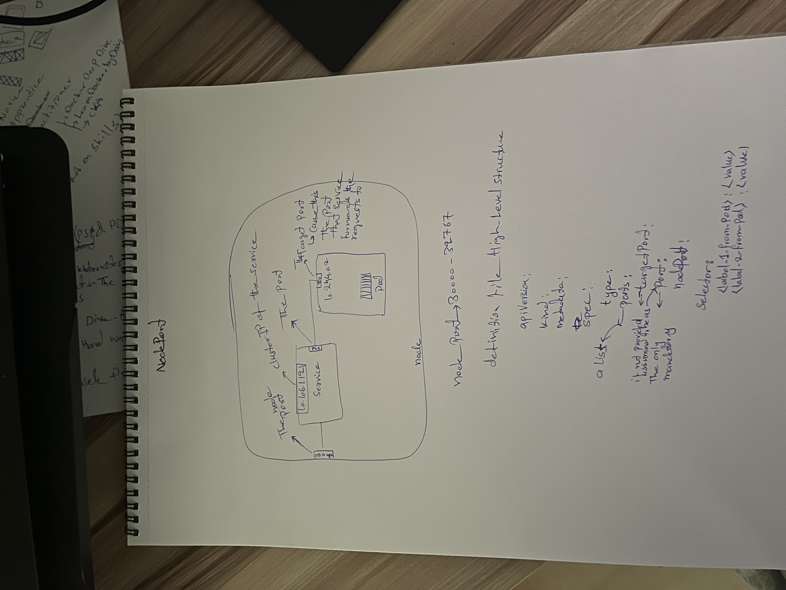
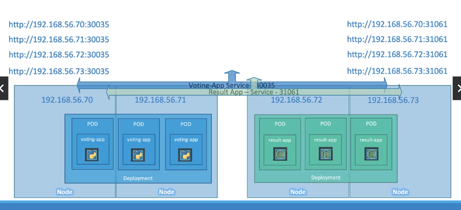
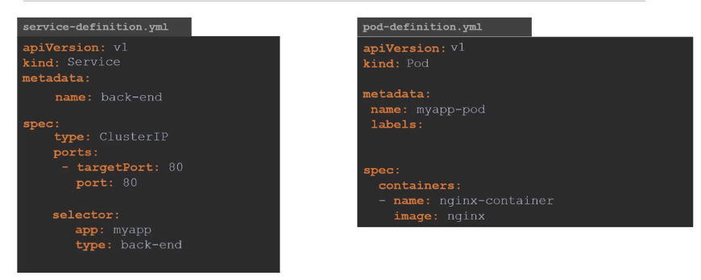

Services in k8s
===============

- Enabling connectivity between groups of pods
- Application to user connectivity
- Communication between backend and frontend pods
- connectivity to an external data source
- Enalbe loose coupling

### Types:
   1. NodePort: Port mapping between pod and node, or making an external facing application available via node
      - Service
         - ClusterIP of the service
         - port
      - NodePort
      - TargetPort
      - Multiple pods: Selector selects all of them using the *labels* and distributes the load in a random manner
      - Pods across multiple ndoes: Service is spanned across all the nodes in the cluster and target nodes are mapped to the same nodes' port on the cluster
      
      
   2. ClusterIP: Expose the service on a cluster internal IP (Used Internally)
      - Why?
         - Pods being ephemeral, the IPs set on them are not reliable for internal Communication (Not static IP)
         - And also load balancing
      - A single interface for a group of pods to be accessed via it
         - Once a request hits the service it'll be forwarded to one of the pods randomly
      - Allows easire deployment of pods and coupling
      
   3. LoadBalancer:
      - Only works with supported cloud providers
