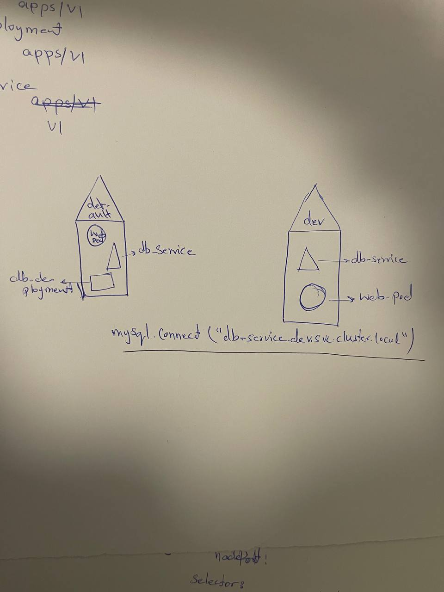

NameSpaces
==========
Some of these contents are taken from this [link](https://sysdig.com/blog/kubernetes-limits-requests/)

- *Default* namespace
- *kube-system* namespace
- *kube-public* resources available to all the users
- *kube-node-lease*

- **Policies** defined for each namespace
- **quotas** of resources to each namespace
- **Referring to resources**
   - Referring to resources within a namespace is possible by simply *hostname (DNS)* for that specific resource
   - Resources inside other namespaces, consider example below:
   
   - The format is the following: `<serviceName>(db-service).<nameSpace>(db).<service>(svc).<domain>(cluster.local)`
      - `cluster.local` --> default domain name of the k8s cluster
      - `svc` --> subdomain for service
      - This is possible due to the fact that at the time of service creation a **DNS entry** is added automatically, in this specific format

### Operational aspects of namespaces
   - To declare a resource (take pod as an example) in a specific namespace, just add the `namespace: desiredNamespace` in the definition file, under the metadata section

### How to *Create* a new namespace
   - **Declarative**
      - Use definition file
         - `apiVersion: v1`
   - **Imperative**
      - Run command
         - `kubectl create namespace <name>`

- How to set current or default namespace to a desired one:
   - `kubectl config set-context --namespace=<namespace>`
   - `kubectl config current-context --namespace=<namespace>`
- See resources in all namespaces:
   - `kubectl get <resource> --all-namespaces`

### Resource Quotas
   - Also called **tenants**
   - Declarative:
      ```
      apiVersion: v1
      kind: ResourceQuota
      metadata:
         name: <Name>
         namespace: <namespaceName>
      spec:
         hard:
            pods: "<numberOfAllowedPods>"
            requests.cpu: "<numberOfAllowedPods>"
            requests.memory: <allowedMemory>Gi
            limits.cpu: "<numberOfAllowedPods>"
            limits.memory: <allowedMemory>Gi
      ```
      - *limits*:
         - maximum amount of a resource
         - *no requests* = requests same as limits
         - Checked and enforced at *runtime*
      - *requests*:
         - minimum guaranteed amount of a resource that is reserved
         - When delivering a pod, *kube-scheduler* makes sure to deploy it to a node, that could meet the requests (min guaranteed) for all the containers on that pod
            - If couldn't find a node, the pod will not be *scheduled* and remains in the **pending** status
         - *no requests* = requests same as limits
      - *cpu* particularities:
         - *stretchable*
         - *smallest unit* 1m (m--> millicore)
         - 1 cpu --> 1000 millicores
      - *memory* particularities:
         - *non-stretchable*
         - Measured in *bytes*
         - m (lowercase) --> represents *Millibytes*
            - Ridiculously low
         - can use Ki, Mi, Gi, Ti, ...
      - *Best Practices*
         - Requests should be used in the *first place*
         - Limits should be used in few cases
   - Get current quotas for a namespace --> `kubectl get resourcequota -n <namespace>`
   - Once a resourcequota for a given resource is set in a namespace, that should be done also accordingly for every pod in that namespace, or else it will return a *failed quota* error
   - If trying to add a pod or container, that *exceeds* the current resourceQuota, k8s will return a *exceeded quota* error
